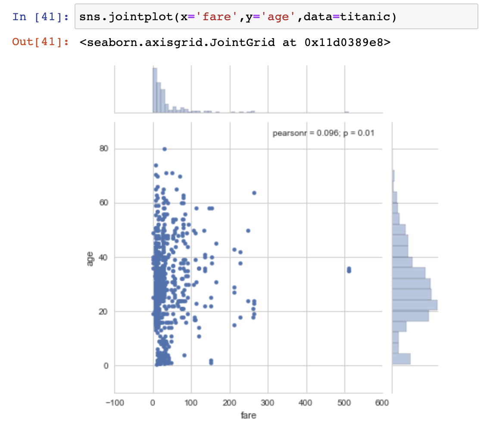
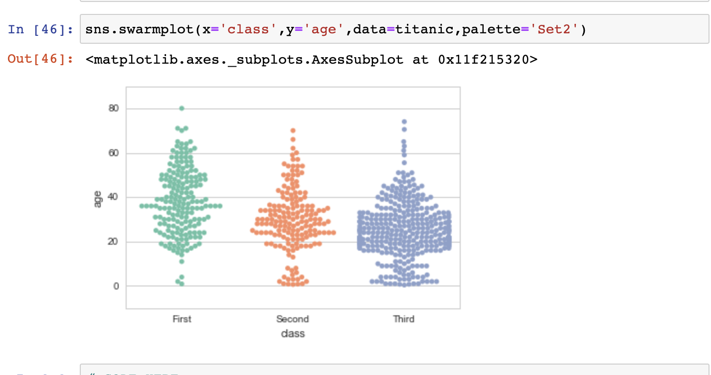
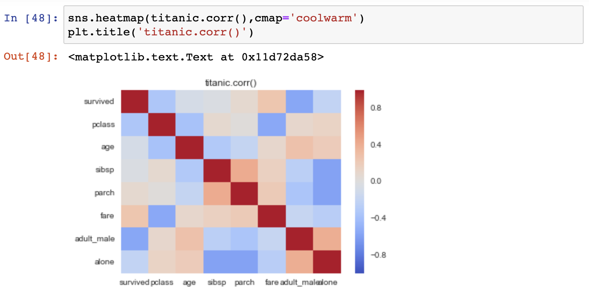

# Python-Data-Visualization-Practice

Attached are examples of data visualization leveraging seaborn, matplotlib, plotly, and cufflinks. Below are images of some of my favorite

## Cufflinks 
Leveraging cufflinks I created scatter, bar, box, spread, ratio, heatmap, surface, histogram, and bubble plots. Below is a screenshot of my 3D surface plot:

## Seaborn
Leveraging Seaborn, I created a jointgrid, distplot, boxplot, swarmplot, barchart, heatmap, and histogram using a Titanic themed dataframe. Below are the jointgrid, swarmplot, and heatmap visualizations I created:

#### jointgrid

#### swarmplot

#### heatmap

## Matplotlib
Below is an area plot of all the columns for just the rows up to 30 in my dataframe with legend displayed on the outside:

## Plotly
Leveraging plotly I used x,y, and z arrays to recreate a plot below to zoom in on the results I am most interested in:

