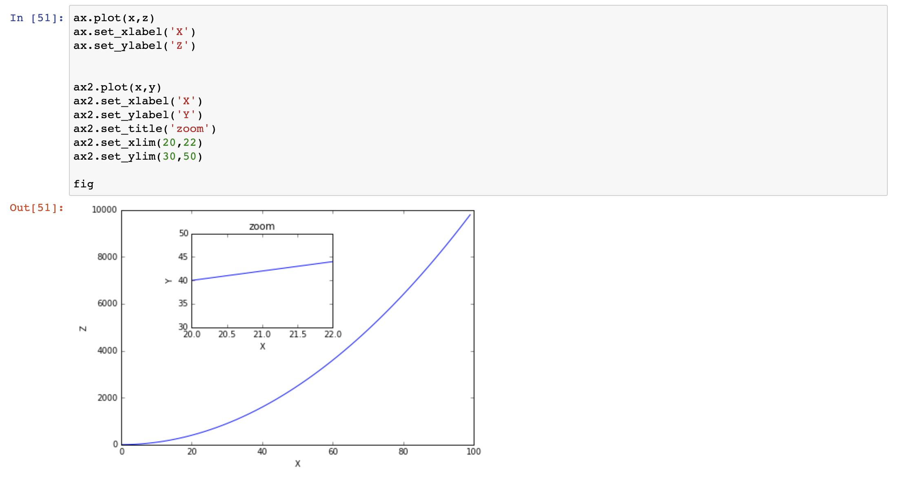
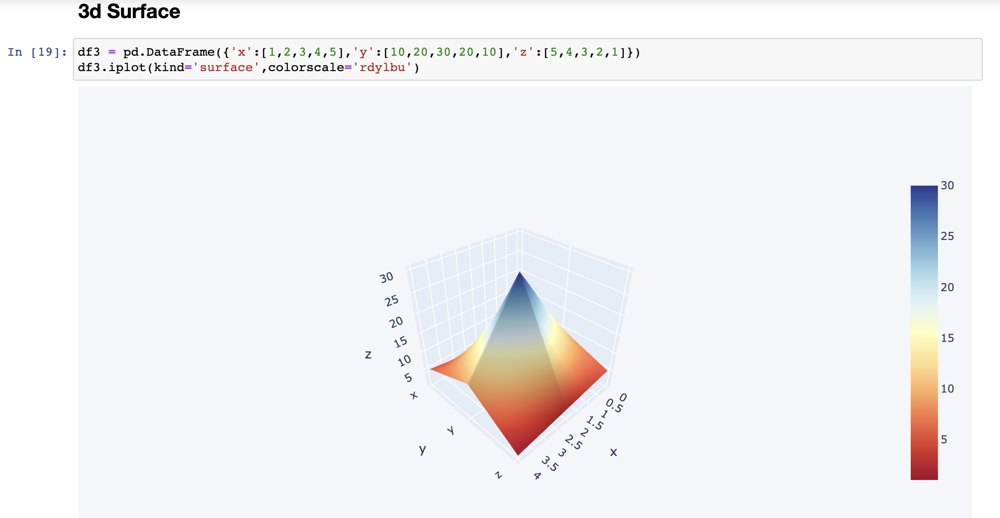

# Python-Data-Visualization-Practice

Attached are examples of data visualization leveraging seaborn, matplotlib, plotly, and cufflinks. Below are images of some of my favorite

## Seaborn

## Matplotlib

## Plotly
Leveraging plotly I used x,y, and z arrays to recreate a plot below to zoom in on the results I am most interested in:

## Cufflinks 
Leveraging cufflinks I created scatter, bar, box, spread, ratio, heatmap, surface, histogram, and bubble plots. Below is a screenshot of my 3D surface plot:

